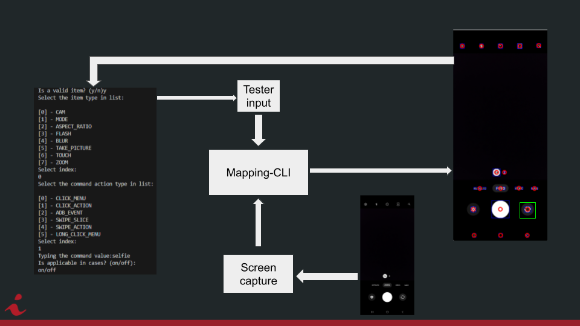

# celular-camera-mapping
- Simplificar o processo de cadastrar um novo device para ser testado, em suas diversas configurações de câmera.
- Com ajuda do testador, rotular cada ícone para sua ação em um conjunto pré-definido, como: trocar a câmera, abrir e selecionar uma opção no menu de aspect ratio.
- Conforme novas configurações vão sendo mapeadas, a ferramenta vai explorando combinações e descobrindo novas telas para serem mapeadas.
- Todo o processo leva em torno de 30 minutos.

# Execution Flow

