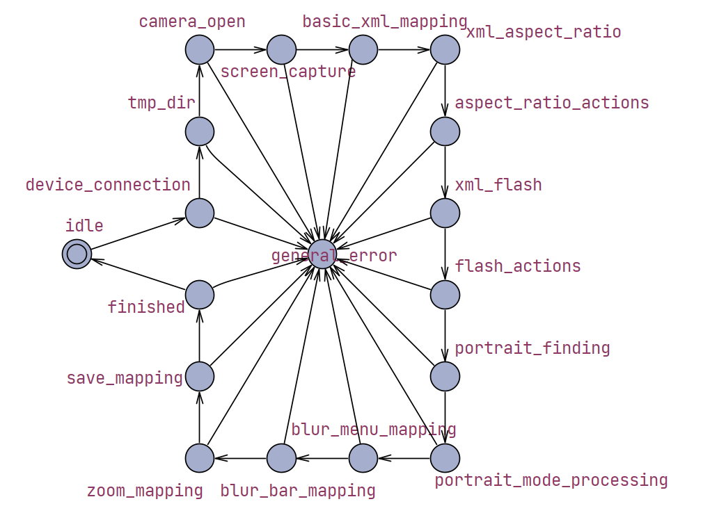

# Camera Mapper
Camera Mapper is a general-purpose Android camera app mapper designed to automate tap/click positions on your device's screen. It supports both command-line interface (CLI) and API usage, making it flexible for various automation workflows.

**Requirements:**  
- Android Debug Bridge (ADB) installed
- Device's main camera faced down
- Ensure your Android device is connected via Wi-Fi debugging (ADB over network)

## Features
- Map and automate screen tap positions
- Use as a CLI tool or integrate via API
- Suitable for testing, automation, and scripting tasks

## CLI Usage

```sh
camapper -i [ANDROID-DEVICE-IP] -hv [DEVICE-HARDWARE-VERSION]
```

Replace `[ANDROID-DEVICE-IP]` and `[DEVICE-HARDWARE-VERSION]` with your device's actual IP address and Hardware version.

## API Usage

```python
from camera_mapper import CameraMapper

mapper = CameraMapper(device_ip="192.168.1.100", device_hardware_version="1.0.0")
mapper.map()
```

## Execution Flow


## Output example
```json
{
    "HARDWARE_VERSION": "1.0.0",
    "SOFTWARE_VERSION": "14",
    "BRAND": "samsung",
    "MODEL": "SM-A042M",
    "CAMERA_VERSION": "11.0.02.95 (A042MUBU6DXA2-00)",
    "CAM": [
        599,
        1350
    ],
    "TAKE_PICTURE": [
        360,
        1350
    ],
    "TOUCH": [
        360,
        800
    ],
    "QUICK_CONTROLS": null,
    "ASPECT_RATIO_MENU": [
        500,
        117
    ],
    "ASPECT_RATIO_3_4": [
        192,
        118
    ],
    "ASPECT_RATIO_9_16": [
        304,
        118
    ],
    "ASPECT_RATIO_1_1": [
        416,
        118
    ],
    "ASPECT_RATIO_FULL": [
        528,
        118
    ],
    "FLASH_MENU": [
        220,
        117
    ],
    "FLASH_ON": [
        472,
        118
    ],
    "FLASH_OFF": [
        248,
        118
    ],
    "FLASH_AUTO": [
        360,
        118
    ],
    "PORTRAIT_MODE": [
        201,
        1212
    ],
    "BLUR_MENU": [
        656,
        1087
    ],
    "BLUR_BAR_MIDDLE": [
        361,
        1109
    ],
    "BLUR_BAR_BEFORE": [
        311,
        1109
    ],
    "BLUR_BAR_NEXT": [
        411,
        1109
    ],
    "ZOOM_1": [
        328,
        1088
    ],
    "ZOOM_2": [
        392,
        1088
    ]
}
```